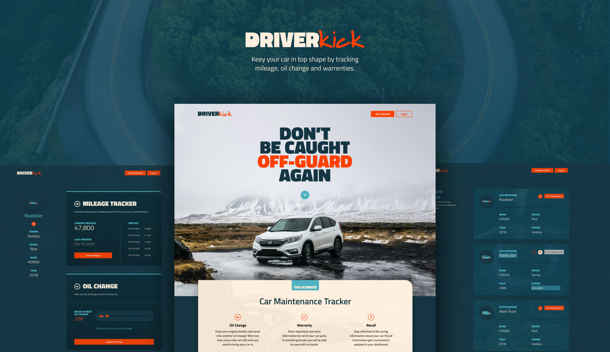
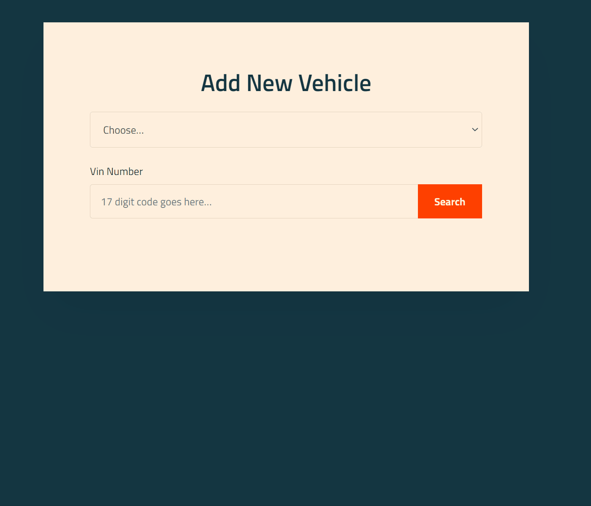
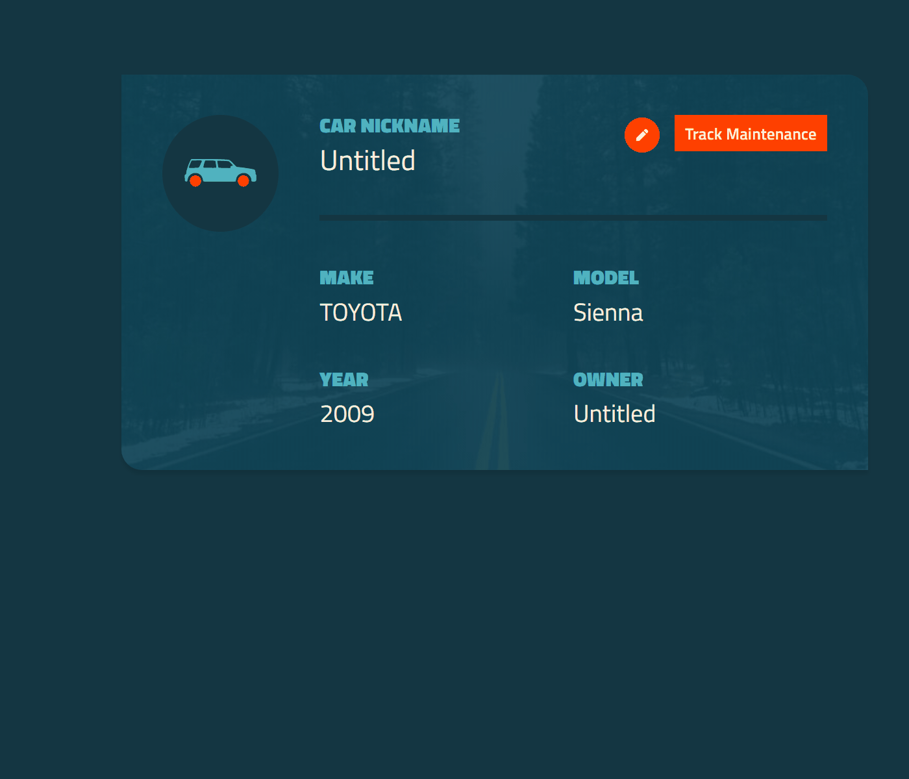

<!-- #  -->


<br>



<br><br>


# [View DriverKick's Live Site ↗️](https://driverkick.herokuapp.com/)

* It's easy to create a free account or use these demo logins. 

 * Email: sample@test.com
 * Password: 123456

* Please note that this is hosted on a free Heroku account, so loading the website for the first time might take a few seconds.


## <center> User Story
<center><h3> As a <span style="color:#50B2C0">vehicle owner,</span> I want a multi-purpose vehicle <span style="color:#50B2C0">maintenance tracker</span> so that I can ensure I am up to date on my vehicle’s upkeep.</h3> </center>
 
 <br>
 
## Table of Contents
1. [Technology Used](#technology-used)
2. [Installations](#installations)
3. [Future Development](#future-development)
4. [Awesome Feature Code](#awesome-feature-code)
5. [Team Contact Information](#team-contact-information)

<br>

## Technology Used:
- HTML
- CSS/BEM
- JSX
- React
- MongoDB
- Express
- Passport
- Github
- [NHTSA Vehicle API](https://vpic.nhtsa.dot.gov/api/)
- Project Management Tools:
    - [Trello](https://trello.com/b/nZ7TqRzj/a-team) (Team Collaboration / Task Management)
    - [Figma](https://www.figma.com/file/EHbfwBaOA1QPQggMB3rZby/A-Team-%E2%80%94-Car-Maintainence-Tracker?node-id=448%3A435) (Design Layout)
    - G Suite (Component Organization / Slides Presentation)
- Deployed Application:
    - Heroku (App Link)
    - MongoDB Atlas (Database link)

<br>

## Installations:
```
$ npm axios
$ npm nodemon
$ npm bcryptjs
$ npm react-bootstrap
$ npm express
$ npm express-session
$ npm mongoose
$ npm passport
$ npm react-contenteditable
$ npm react-moment
$ npm react-ga
```
<br>
 
## Future Development:
- Scheduling maintenance alerts for oil change
- Push notification for Mileage tracking
- PWA the site for mobile and offline use
- Local maintenance shop tracker with ratings
- Create a light mode for the dashboard
- Recall card with working API
– Code Splitting for Performance Enhancements

 <br>

 ## Awesome Feature Code:

> 
- The user inputs their vehicles VIN number, which is then sent to the NHSTA government API for decoding. The information 
comes back and the user verifies the information matches their vehicle, and the vehicle is created. This allows for easy 
one input entry to create vehicles and get accurate information. This prevents the user from being confronted with a large 
form that could be filled with accidentally erroneous information.
 
 <br>
 
> 
- The user's information and vehicle data is pulled from the MongoDB database using RESTful api commands. Each vehicle is then mapped through, creating a uniformed card for each one, with a unique image background. The user can update their car's nickname and the owner name directly on the card. They can also delete any card they want. Lastly, each card takes the user to that vehicle's tracking dashboard, where they can track its mileage, oil changes and warranties.  

<br>

> 
- The oil change card receives all the information it needs from the backend in one simple call. First, the backend calculates the oils to next change by adding the oil interval to the miles at last oil change, then subtracting the vehicles current mileage. Then, it calculates the percentage to the next oil change and subtracts 100. This number is used in the progress bar. We subtract the percentage from 100 to have the bar empty rather than fill, to simulate a gas tank or oil tank slowly running out.
- The oil change card also allows the user to add an oil change. This is a double feature, as not only does it allow the user to input their new interval, it also automatically updates their current mileage, and even creates a history entry for the mileage tracker card!

 <br>

## Team Contact Information:
<br>

### <span style="color:#F0B537">Lathisha Nair</span> | Project Manager / QA Specialist
Email: | <lathisha.n@gmail.com> |
--- | --- 
LinkedIn: | <https://www.linkedin.com/in/lathishanair/> |


<br>

### <span style="color:#007cba">Gedalya Krycer</span> | Front-end / Design Specialist
Email: | <gedalya@krycer.com> |
--- | --- 
LinkedIn: | <https://www.linkedin.com/in/gedalyakrycer/> |


<br>

### <span style="color:#0AFFDD">Nina Rocket</span> | Front-end / Javascript Boss
Email: | <ninamrocket@gmail.com> |
--- | --- 
LinkedIn: | <https://www.linkedin.com/in/ninarocket/> |


<br>

### <span style="color:#26FFAD">Jacob Cravey</span> | Back-end / Routes Specialist
Email: | <j.t.cravey1991@gmail.com> |
--- | --- 
LinkedIn: | <https://www.linkedin.com/in/jacob-cravey-2367561a8/> |


<br>

### <span style="color:#F8963F">Linnea Gear</span> | Back-end / MonGOD
Email: | <linneagear@gmail.com> |
--- | --- 
LinkedIn: | <https://www.linkedin.com/in/linnea-gear/> |


