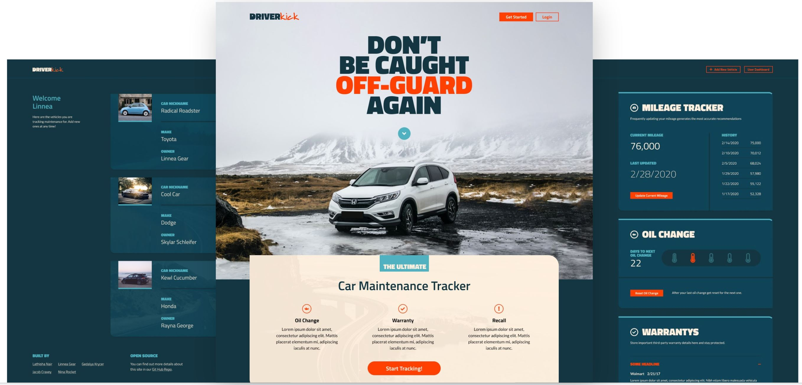

# 


<br>

<center>

# [DriverKick Deployed Link](https://driverkick.herokuapp.com/)
</center>


<br><br>

## <center> User Story
<center><h3> As a <span style="color:#50B2C0">vehicle owner,</span> I want a multi-purpose vehicle <span style="color:#50B2C0">maintenance tracker</span> so that I can ensure I am up to date on my vehicle’s upkeep.</h3> </center>
 
 <br>
 
## Table of Contents
1. [Technology Used](#technology-used)
2. [Installations](#installations)
3. [Future Development](#future-development)
4. [Awesome Feature Code](#awesome-feature-code)
5. [Team Contact Information](#team-contact-information)

<br>

## Technology Used:
- HTML
- CSS/BEM
- JSX
- React
- MongoDB
- Express
- Passport
- Github
- [NHTSA Vehical API](https://vpic.nhtsa.dot.gov/api/)
- Project Management Tools:
    - Trello (Team Collaboration / Task Management)
    - Figma (Design Layout)
    - G Suite (Component Organization / Slides Presentation)
- Deployed Application:
    - Heroku (App Link)
    - MongoDB Atlas (Database link)

<br>

## Installations:
```
$ npm axios
$ npm nodemon
$ npm bcryptjs
$ npm react-bootstrap
$ npm express
$ npm express-session
$ npm mongoose
$ npm passport
$ npm react-contenteditable
$ npm react-moment
$ npm react-ga
```
<br>
 
## Future Development:

- Scheduling maintenance alerts for oil change
- Push notification for Mileage tracking
- Oil change meter has dynamic animation when user is close to an oil change
- PWA the site for mobile and offline use
- Local maintenance shop tracker with ratings
- Create a light mode for the dashboard

 <br>

 ## Awesome Feature Code-

> 1st feature: Vin Number and how it works
- The user inputs their vehicles VIN number, which is then sent to the NHSTA government API for decoding.
- The information comes back and the user verifies the information matches their vehicle, and the vehicle is created.
- This allows for easy one input entry to create vehicles and get accurate information.
 
 <br>
 
> 2nd feature: How info is put into User Dashboard card
- Explanation~

<br>

> 3nd feature: Oil change card, math behind it. How the icon progresses.
- The oil change card recieves all the information it needs from the backend in one simple call. First, the backend
calculates the oils to next change by adding the oil interval to the miles at last oil change, then subtracting the 
vehicles current mileage. Then, it calculates the percentage to the next oil change and subtracts 100. This number is
used in the progress bar. We subtract the percentage from 100 to have the bar empty rather than fill, to simulate a gas tank
or oil tank slowly running out.
- The oil change card also allows the user to add an oil change. This is a double feature, as not only does it allow the
user to input their new interval, it also automatically updates their current mileage, and even creates a history entry
for the mileage tracker card!

 <br>

## Team Contact Information -
<br>

### <span style="color:#F0B537">Lathisha Nair</span> | Project Manager / QA Specialist
Email: | <lathisha.n@gmail.com> |
--- | --- 
LinkedIn: | <https://www.linkedin.com/in/lathishanair/> |


<br>

### <span style="color:#007cba">Gedalya Krycer</span> | Front-end / Design Specialist
Email: | <gedalya@krycer.com> |
--- | --- 
LinkedIn: | <https://www.linkedin.com/in/gedalyakrycer/> |


<br>

### <span style="color:#0AFFDD">Nina Rocket</span> | Front-end / Javascript Boss
Email: | <ninamrocket@gmail.com> |
--- | --- 
LinkedIn: | <https://www.linkedin.com/in/ninarocket/> |


<br>

### <span style="color:#26FFAD">Jacob Cravey</span> | Back-end / Routes Specialist
Email: | <> |
--- | --- 
LinkedIn: | <https://www.linkedin.com/in/jacob-cravey-2367561a8/> |


<br>

### <span style="color:#F8963F">Linnea Gear</span> | Back-end / MonGOD
Email: | <linneagear@gmail.com> |
--- | --- 
LinkedIn: | <https://www.linkedin.com/in/linnea-gear/> |


<br>